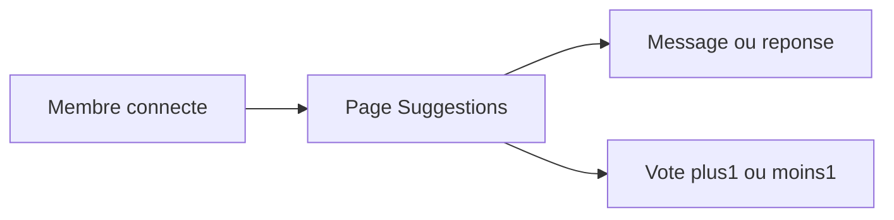

# Forum de suggestions familiales

## Règles métier

- **Visible** uniquement dans l’app connectée (pas la page publique `/presentation`).
- **Lire** : tout membre autorisé (`admin`, `owner`, `sub_member`).
- **Écrire / répondre** : `admin` et `owner` (éditeur ou non). Les `sub_member` (« Famille & Amis ») n’ont pas de formulaire.
- **Voter** : tout membre autorisé, sur les messages **et** les réponses. Un seul vote par personne et par message (+1, -1, ou retirer le vote en recliquant).
- **Sujets** : liste fixe dans le code (pas de CRUD) :
  - Équipement de la maison
  - Gestion des locations
  - Bons plans autour de la maison
  - Autre
- **Hors v1** : notifications push/email, pièces jointes, édition avancée. L’auteur pourra modifier/supprimer son propre texte ; un `admin` pourra supprimer n’importe quel message (modération).

## Données (Supabase)

Deux tables à ajouter dans [`supabase/schema.sql`](supabase/schema.sql) **et** un script incrémental [`supabase/feedback.sql`](supabase/feedback.sql) à exécuter sur le projet existant (le schéma from-scratch contient des `DROP TABLE`).

**`feedback_messages`**

- `id`, `author_id` → `members(id)`, `category` (check sur les 4 clés), `body` (texte non vide)
- `parent_id` nullable → self-FK (null = message, non-null = réponse, un seul niveau)
- `created_at`, `updated_at`

**`feedback_votes`**

- `id`, `message_id` → `feedback_messages(id)` ON DELETE CASCADE
- `member_id` → `members(id)`
- `value` check `in (-1, 1)`
- unique `(message_id, member_id)`

Helpers RLS (réutiliser `current_member_is_allowed()`, `current_member_id()`, `current_member_role()` déjà dans le schéma) :

- lecture messages/votes : membre autorisé
- insert message : auteur = membre courant **et** rôle `admin` ou `owner`
- update/delete message : auteur **ou** admin
- insert/update/delete vote : membre courant, membre autorisé

## App (conventions existantes)

Suivre le découpage actuel : types dans [`src/types.ts`](src/types.ts), `Db*` dans [`src/services/dbTypes.ts`](src/services/dbTypes.ts), conversions uniquement dans [`src/services/apiMappers.ts`](src/services/apiMappers.ts), lecture dans [`src/services/api.ts`](src/services/api.ts), écriture dans [`src/services/apiCrud.ts`](src/services/apiCrud.ts), toasts dans [`src/services/messageCatalog.ts`](src/services/messageCatalog.ts).

Permissions dans [`src/services/permissions.ts`](src/services/permissions.ts) :

- `viewSuggestions: true` pour tout membre
- `createSuggestions: true` pour `admin` et `owner`

Navigation : nouvelle vue `suggestions` dans [`AppShellLayout.tsx`](src/components/app/AppShellLayout.tsx), entrée de nav **sans** `requiredRoles` dans [`App.tsx`](src/App.tsx), route dans [`AppViewRouter.tsx`](src/components/app/AppViewRouter.tsx). Icône type `MessageSquarePlus` (lucide).

## UI

Nouvelle page [`src/pages/SuggestionsPage.tsx`](src/pages/SuggestionsPage.tsx) + composants extraits (Atomic Design, pas de sous-composants inline) dans `src/components/suggestions/` :

- filtres par sujet (pills ou [`FilterBar`](src/components/ui/FilterBar.tsx))
- formulaire de nouveau message (sujet + texte) **si** `createSuggestions`
- liste de cartes (auteur via `members` déjà chargés, date, corps, score net, boutons pouce)
- réponses indentées + formulaire « Répondre » pour les auteurs autorisés
- état vide par sujet

Les votes sont calculés côté client (volume familial) : fetch messages + votes, agrégation par `messageId`.

## Vérification

Après implémentation : `npm run tsc` / lint. Côté UI, parcourir la page en tant que propriétaire (écrire, répondre, voter) et en tant que Famille & Amis (lecture + vote uniquement, pas de formulaire). Appliquer `supabase/feedback.sql` sur le projet Supabase avant de tester contre la vraie base.
